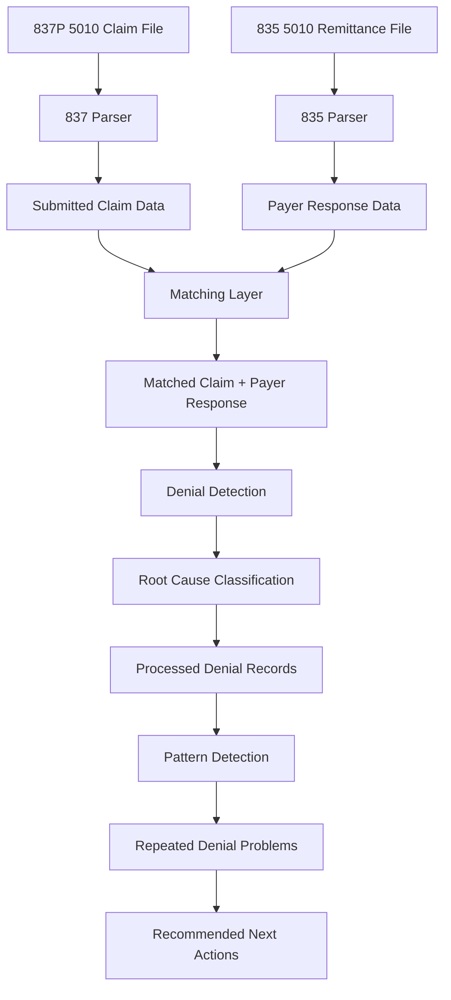

# DenialIQ Project Plan

## What This Project Is

DenialIQ is a simple denial intelligence layer for healthcare claims.
The goal is not to build a big standalone product right away.
The goal is to test whether a small layer on top of billing or revenue cycle data can explain denial problems clearly.

We are still testing how useful this idea is.
So the project should stay small, focused, and easy to run end to end.

The main question is:

```text
Can we turn claim and remittance files into useful denial insights?
```

## Current Scope

For now, the project supports:

```text
837P 5010 claim files
835 5010 remittance files
```

837P means professional claims.
5010 is the EDI version.

We are starting with only 837P 5010 because it keeps the first version focused.
Other claim types and versions can be added later if this works.

## Simple Project Flow

```text
837P file = what was billed
835 file = what the payer paid, denied, or adjusted
DenialIQ = connects both sides and explains the denial problem
```

## Flowchart



## How Matching Will Work

Matching connects the submitted claim to the payer response.
It has not been fully built yet.

The first version can match using simple fields:

```text
claim ID
patient name
payer name
date of service
procedure code
billed amount
```

Example:

```text
837P says claim PATACCT billed CPT 99213 for $150.
835 says claim PATACCT paid $80 and adjusted $70 for CPT 99213.

DenialIQ connects PATACCT + 99213 as the same claim line.
```

After matching, the system knows:

```text
what was billed
what was paid
what was denied or adjusted
why it happened
```

If a match is not found, the record should still be saved as unmatched.

## How Pattern Detection Will Work

Pattern detection looks at all processed denial records and groups similar problems.

It should answer:

```text
What keeps happening?
Where is it happening?
How much money is affected?
What should someone fix first?
```

The first version can group denials by simple combinations:

```text
payer + denial code
payer + procedure code
payer + root cause
department + root cause
provider + root cause
procedure code + denial code
```

Example records:

```text
ANY PLAN USA + CO-45 + CPT 99213
ANY PLAN USA + CO-45 + CPT 99213
ANY PLAN USA + CO-45 + CPT 99213
```

Pattern detection turns that into:

```json
{
  "title": "ANY PLAN USA CO-45 adjustments for CPT 99213",
  "count": 3,
  "revenue_at_risk": 210.0,
  "reason": "Same payer, denial code, and procedure keep repeating.",
  "next_action": "Review the payer contract rate for CPT 99213."
}
```

This is the main value of the project.
Instead of only seeing individual denials, users can see repeated operational problems.

## How LLM Interpretation Will Be Used

The LLM should not calculate numbers or decide matches.
Those parts should stay deterministic in code.

Code should handle:

```text
parsing
matching
denial detection
grouping
counting
revenue totals
pattern ranking
```

The LLM should only explain the results using the context we already calculated.

Main uses:

```text
explain one denial in plain language
explain why a pattern matters
summarize dashboard metrics
suggest a simple next action
```

Example pattern explanation:

```text
The system finds: ANY PLAN USA has 12 CO-45 denials for CPT 99213.

The LLM explains: This looks like a repeated payer contract or fee schedule issue.
The next step is to review the allowed rate for CPT 99213 with this payer.
```

Example dashboard summary:

```text
The system calculates total denials, revenue at risk, top payer, and top root cause.

The LLM explains: Most denial risk is concentrated with one payer and one repeated
root cause, so that area should be reviewed first.
```

This keeps DenialIQ from becoming a chatbot.
The product should feel like the system already analyzed the data and explains what matters.

## What The System Produces

The system should produce clean denial records.

Example:

```json
{
  "claim_id": "PATACCT",
  "payer": "ANY PLAN USA",
  "patient_name": "DOE JOHN",
  "procedure_code": "99213",
  "billed_amount": 150.0,
  "paid_amount": 80.0,
  "denial_amount": 70.0,
  "denial_reason_code": "CO-45",
  "denial_reason_text": "Charge exceeds fee schedule or contracted arrangement",
  "root_cause": "PAYER_POLICY",
  "recommended_fix": "Review the payer contract rate for this procedure."
}
```

This is easier to understand than raw EDI.

## Build Plan

### 1. Parse Files

Convert supported 837P and 835 files into structured data.

### 2. Match Claim And Remittance Data

Connect 837P claim lines with 835 payer response lines.
Start with basic matching and mark uncertain records as unmatched.

### 3. Detect Denials

Use 835 adjustment information to identify denials and payment reductions.

Examples:

```text
CO-45
CO-97
CO-197
CO-204
PR-1
```

### 4. Classify Root Cause

Convert denial details into simple categories:

```text
prior authorization
eligibility
coding
medical necessity
payer policy
timely filing
duplicate claim
```

### 5. Detect Patterns

Group repeated denials and calculate:

```text
count
revenue at risk
common payer
common procedure
common denial reason
recommended next action
```

### 6. Show What To Review First

Create a simple review list based on:

```text
high dollar amount
repeated pattern
appealable denial reason
important payer
```

## What The Project Should Look Like At The End

At the end, someone should be able to run claim and remittance files through DenialIQ and see:

```text
submitted claim data
payer response data
matched claim lines
denied or adjusted lines
root cause for each denial
repeated denial patterns
money at risk
what to review first
```

The final experience should feel like:

```text
Here are the denial problems.
Here is where they are coming from.
Here is how often they repeat.
Here is the money affected.
Here is what to check first.
```
